menu-position:5
Title: Thesis
Description: Thesis
Author: Josh Drizin
Date: 2013/06/23
Robots: noindex,nofollow
---

# Intro
## Adaptive traits
To be considered an adaptive trait, the following conditions must be met:

* a trait must exhibit variation
* variation must be heritable
* those individuals expressing that trait must be more successful

## Examples
The adapatations to improve dispersal are as varied as the impediments they surmount. Modifications can be of seed size, shape, seed coat, and secondary appendages. Here are a few examples of grass seed adaptations.

<table border=""><tr><td>*Cenchrus spinifex*, coastal sandbur</td></tr>
<tr><td>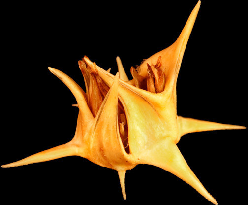 </td></tr>
<tr><td>The spines on the sandbur seed discourage predation. The spines can also improve dispersal by sticking to the feet and fur of animals</td></tr></table>

<table border=""><tr><td>*Uniolata paniculata*, sea oats </td></tr>
<tr><td>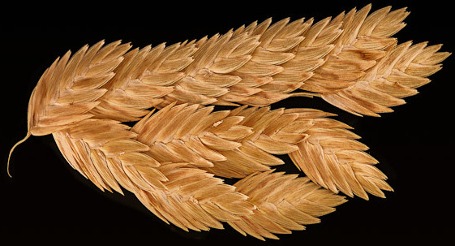</img></td></tr>
<tr><td>The flattened seeds of sea oats can float and disperse by river or ocean currents</td></tr></table>  

<table border=""><tr><td>*Saccharum giganteum*, sugarcane</td></tr>
<tr><td>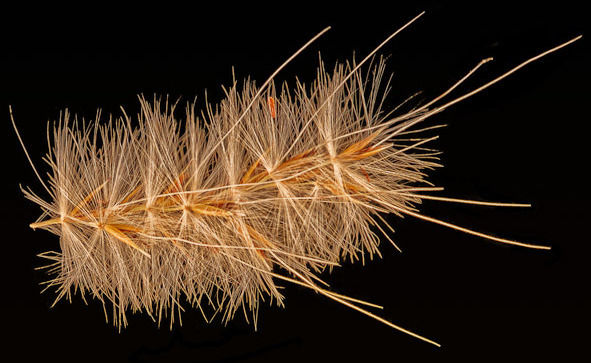</img></td></tr>
<tr><td>The parachutelike tufts on the sugarcane seeds catch the wind to travel further</td></tr></table>  

## Awns
An awn is a bristle-like appendage found on some grass seeds. Passive awns are simple structures, derived from maternal tissue. The awn can aid in wind dispersal and in keeping the seed oriented downwards during dispersal.

<table border=""><tr><td> Active awns</td></tr>
<tr><td><iframe width="640" height="360" src="//www.youtube.com/embed/gKLjriiLWP8" frameborder="0" allowfullscreen></iframe></td></tr>
<tr><td>*Hesperostipa spartea*, needle and thread grass. Seeds spinning as humidity drops. 50x speedup.</td></tr></table>  

An active awn differs from a passive awn in that it has two distinct parts. One part, the hygroscopic section, is closer to the seed itself and reacts to changes in humidity by twisting. The stiff, passive section attached to that has been shown to cause the seeds of several grasses to self-bury in the soil or travel along the ground.

<table border=""><tr><td>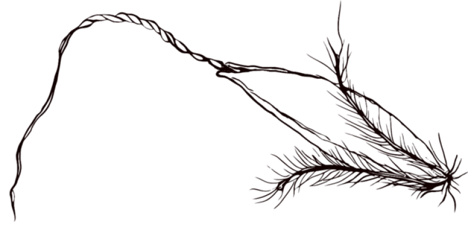</td></tr>
<tr><td>*Sorghastrum nutans* diaspore. The humidity-sensitive portion is proximal to the seed.</td></tr></table>  

## Prairie
The North American prairie once dominated the landscape of central North America, but has been reduced to under 3% of its original range, becoming greatly fragmented due to human settlement.

<table border=""><tr><td> </td></tr>
<tr><td>Historical extent of the North American prairie </td></tr></table>  
  
<table border=""><tr><td>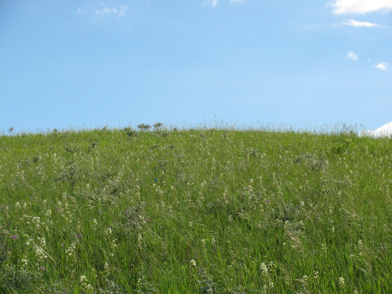 </td></tr>
<tr><td>Minnesota prairie </td></tr></table>  
  
## Big bluestem and Indian grass
Big bluestem (*Andropogon gerardii*) and Indian grass (*Sorghastrum nutans*) are perennial warm-season grasses native to North America. Their range extends from the Rocky Mountains to the East Coast and from Texas through southern Canada. They are the dominant species in tallgrass prairies, where they are found in a dense matrix of grasses, forbs, and dead plant material. Plants grow one to three meters tall and form tussocks. Growth begins in April or May, with flowering beginning in late July⁠, though first-year plants can flower later (personal observation). Seeds develop from September into late October. Seeds do not disperse far from the maternal plant, falling almost straight downward⁠. Big bluestem seeds are borne on three or more spike-like projections while Indian grass seeds are in a dense plume. The diaspore, including the awn, is two to five centimeters long. Seed germination is typically in mid-spring, when temperatures are around 20 °C and humidity is relatively high. Because of the similarity in the two species' seed structure, the experiments were performed unaltered for each species.

<table border=""><tr><td><iframe width="640" height="480" src="//www.youtube.com/embed/dmjnr64jRm4" frameborder="0" allowfullscreen></iframe></td></tr>
<tr><td>Indian grass spinning. 10x speedup</td></tr></table>  
  
## Purpose
To investigate the heritability and utility of the hygroscopic awn in Big bluestem and Indian grass, I performed experiments on two sets of seed. Seeds were collected from populations in west-central Minnesota, which were later grown out and the offspring's seeds collected to estimate heritability. To assess population-level differences and travel along the ground, I purchased seed from five conservation seed suppliers from across the species' range. The overall purposes were to 1. estimate heritability of hygroscopic response among mother and offspring plants, 2. examine differences among hygroscopic responses of seeds from the edges of the species' natural range, and 3. investigate the ability of the seeds to travel along the ground.

# Experiments

## Seed fullness
Because it is difficult to to visually assess seed fullness, I used weight as an indicator. I selected 30 seeds from each species to weigh and dissect. I used this data to determine a cutoff weight for full seeds.

## Time lapse photography
I designed and built a time-lapse photography setup to capture the motion of the awns. I defined this motion, the hygroscopic response, as the time it takes for the awn to complete one rotation, as viewed from above. To photograph seeds from above and to allow unrestricted motion, I attached seeds to balsa wood sticks using Glue Dots. This let me remove the seeds after photography without damaging them. 

<table border=""><tr><td>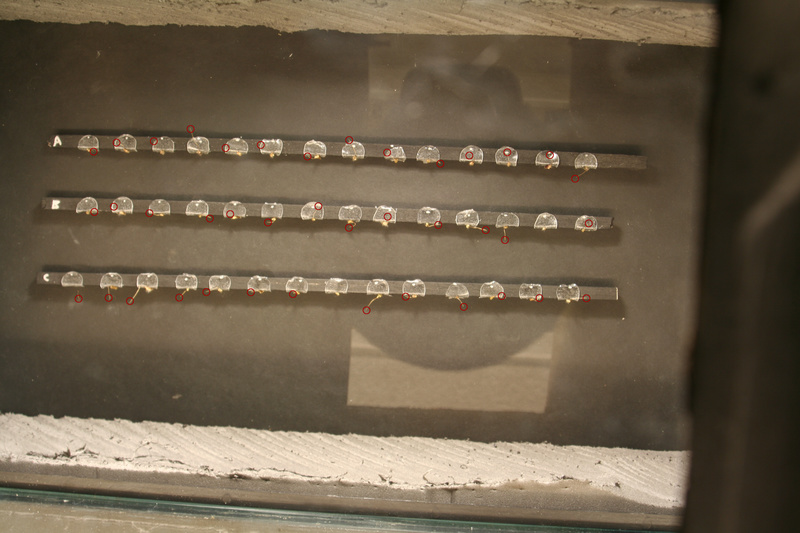 </td></tr>
<tr><td>Photograph from the camera during the course of the experiment</td></tr></table>   
  
Once the seeds were placed on the sticks, I put them in a humid aquarium overnight to "charge up" with moisture. The next day, I put the sticks under another aquarium in ambient humidity, which was around 20%, and set the cameras above. I then used the computer to control the time-lapse capture. The cameras captured one photograph every 5-7 seconds for about 2 hours. Over the course of the project, over 50,000 photographs were taken. See the time lapse page for more detail. FIXME
  
<table border=""><tr><td>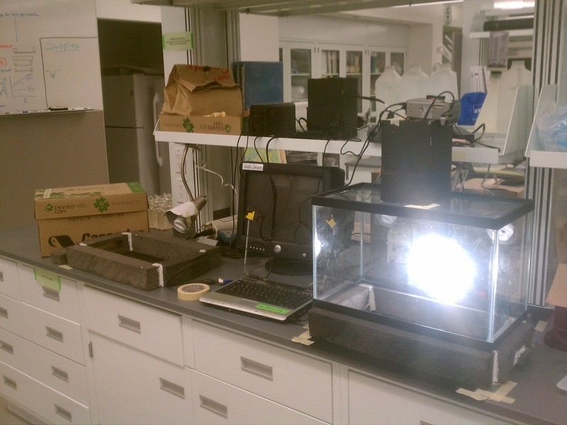 </td></tr>
<tr><td>Photograph of the time lapse setup. </td></tr></table>  
  
## Heritability
This experiment examines the relationship between the hygroscopic response of the offspring compared to that of their mothers.

### Methods
Seeds were collected from remnant and restoration populations in Douglas County, Minnesota. Seeds were collected and stored separately as individual maternal lines. I selected seeds preferring those that were heavy enough to be full and assessed their hygroscopic response. After the hygroscopicity data were collected, seeds were planted in plug trays and germinated in a climate-controlled growth chamber. Once germinated, seedlings were planted out in a common plot in Minnesota. Once the plants grew up, I collected the seeds to assess hygroscopic response of the offspring. I performed a regression of the offspring response to the response of the maternal plants to estimate heritability.

<table border=""><tr><td>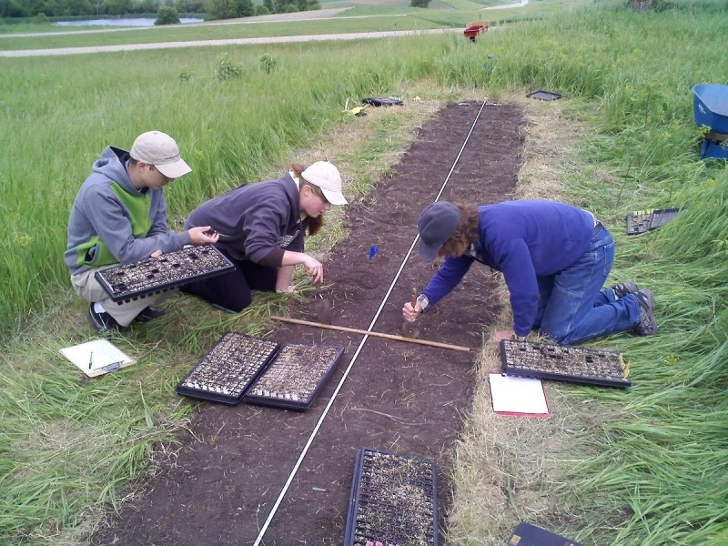 </td></tr>
<tr><td>The seedlings get planted </td></tr></table>  

### Results and discussion

There was little evidence of a relationship between maternal and offspring hygroscopicity in either species (*Andropogon*: ½H²=0.14, 95%CI -0.15 – 0.50, p= 0.17 ; *Sorghastrum*: ½H²=2.4, 95%CI -11 – 16.7, p= 0.19). Hygroscopic response differed among individual maternal plants for both *Andropogon* (p= 0.002, r² = 0.23) and *Sorghastrum* (p < 0.001 , r²= 0.30). *Andropogon* and *Sorghastrum* awns completed one revolution in 6 and 4 minutes, respectively. There was no evidence that collection site or site type were related to hygroscopicity in either model (Andropogon: p = 0.28, Sorghastrum: p = 0.12).

<table border=""><tr><td>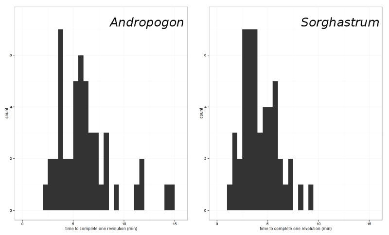 </td></tr>
<tr><td>The amount of time taken to complete one full revolution by maternal line.</td></tr></table>  
  
<table border=""><tr><td>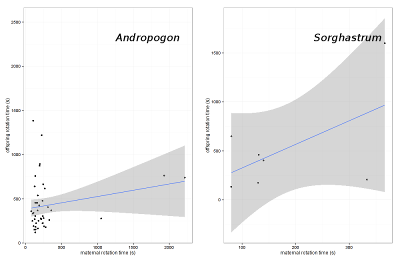 </td></tr>
<tr><td>Estimate of heritability for each species.FIXME </td></tr></table>  
  
## Population differences
This experiment examines the differences among populations from across the species' range.

### Seed material
I acquired the seed for this experiment from conservation seed suppliers from five regions across the eastern US: Prairie Moon, Minnesota; Stock Seed Farm, Nebraska; Ernst Conservation Seed, New York; Mellow Marsh Farms, North Carolina; Native American Seed, Texas. Seeds were purchased or donated as bulk seed. FIXME

<table border=""><tr><td>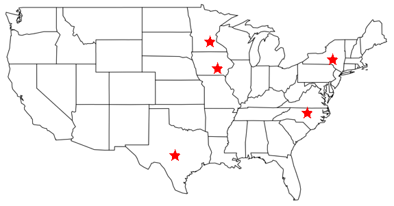 </td></tr>
<tr><td>Seed source locations</td></tr></table>  

### Methods
Seeds were selected from each population and their hygroscopic response was assessed using time lapse photography. Rotation rate was compared among populations.

### Results and discussion
Hygroscopic response did not differ among the five populations in *Andropogon* (p= 0.9). The awns of the Minnesota population took about 6 ± 4 minutes to complete a revolution while the North Carolina, Nebraska, New York, and Texas populations completed a revolution in 3 ± 1 minutes. Hygroscopic response also differed among populations of *Sorghastrum* (r²=0.16, p= 0.04). Minnesota and New York awns completed a revolution slowly, at 7.5 ± 3 minutes and 8.5 ± 5 minutes, respectively, compared to the faster 4-5 minutes of the North Carolina, Nebraska, and Texas  populations.

<table border=""><tr><td>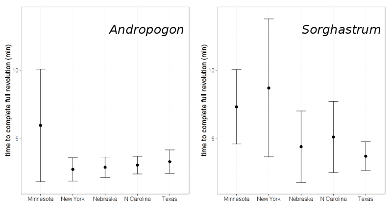 </td></tr>
<tr><td>The average time for an awn to complete a full revolution by seed site and origin. The error bars are 95% confidence intervals. Sites are arranged from north to south.</td></tr>  

## Ground movement
This experiment assessed the ability of the awn's motion to move the seed along the ground.

### Seed material
I used the same seeds as in the population differences experiment

### Methods##
For each species, I chose twenty-eight seeds from each of the five seed suppliers and placed them in a humid chamber overnight without placing them on balsa sticks. I placed the seeds lying down on a textured paper substrate in the photography setup and started time-lapse. 

<table border=""><tr><td>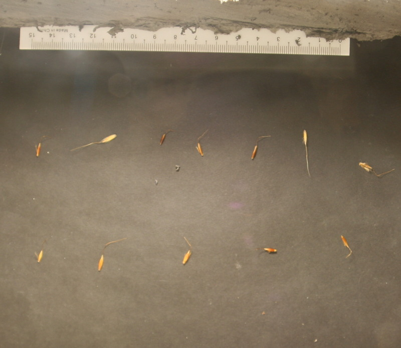 </td></tr>
<tr><td>Seeds on the paper substrate</td></tr></table>  

I marked starting and ending positions of the tip of the seed in ImageJ and calculated distance traveled with R. To measure awn length, I placed the same seeds on a labeled sticky-note and placed them on a flatbed scanner. To get a good scan, I had to lower the the top of the scanner to flatten the awns. This is a destructive process, and some awns were damaged during scanning. I included a ruler in the scans to calculate scale. I used ImageJ to measure the length of the awns. I performed an ANCOVA with distance traveled as the response and time to complete one rotation, seed source, and awn length as explanatory factors.

### Results and discussion

<table border=""><tr><td><iframe width="640" height="480" src="//www.youtube.com/embed/76i38JuajgM" frameborder="0" allowfullscreen></iframe></td></tr>
<tr><td>Indian grass kind of moving</td></tr></table>  

Diaspores for both species moved, from beginning of photography to end, less than 0.5 cm, save for a single individual in each species, each of which moved about 3 cm (Figure 5). Seeds did, however, move back and forth within a range of less than 1 cm over the duration of filming.
Hygroscopic response was not associated with distance moved along the ground for either Andropogon (F = 0.3093 on 1 and 22 DF, p = 0.58) or Sorghastrum (F = 0.3985 on 1 and 19 DF, p = 0.54). Origin location was not a significant explanatory variable in either model (Andropogon p = 0.55, Sorghastrum p = 0.46). Awn length is not a significant predictor of distance traveled for Andropogon (F = 0.4946 on 1 and 25 DF, p = 0.49) or Sorghastrum (F = 0.5901 on 1 and 23 DF, p = 0.45) (Figure 6).

 <table border=""><tr><td>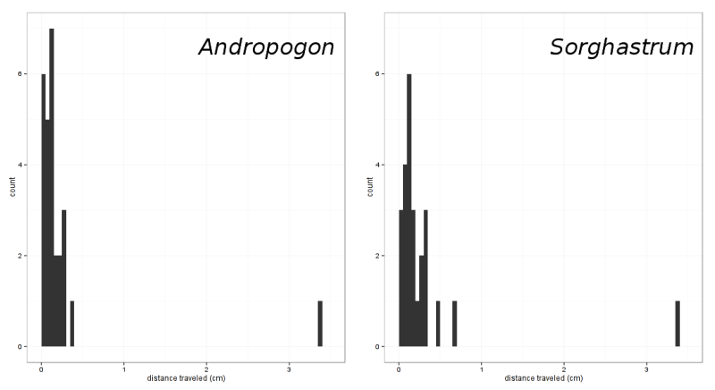 </td></tr>
<tr><td>Histogram of distance traveled over the paper substrate by the seeds. Seeds did not travel far, instead moving mostly back and forth. One seed from each species traveled farther than one child</td></tr></table>  

# Conclusions

# Further reading
My thesis (pdf)
selected papers
